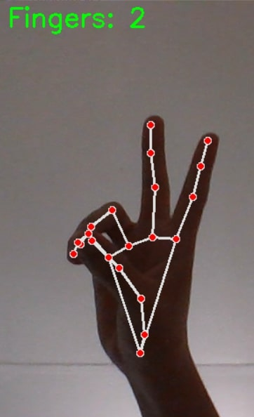

# minority-report-style-interface
I challenge myself to build a real-time minority report style interface into your own life. You need to connect calendar, gmail, whatsapp, photos and any inputs you can think of. Ideally you can search by contact and see communications across channels. Ideally you can toggle channels on / off.

https://discord.com/channels/1083769079904616459/1083769349980049448

I want to create something like this:

Of course in my own personal way 🤣

Packages that is being used:

* open-cv2
* mediapipe
* Python 3.10.11

Simple Demo of the project:

What the programe should do is that each number of fingers you show will do a certain taks:

* 1 Finger = Opens Gmail
* 2 Fingers = Opens Calendar
* 3 Fingers = Opens WhatsApp
* 4 Fingers = Opens Github

